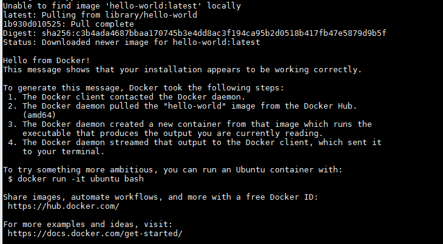

Install docker
==========================

Docker es un proyecto de código abierto que automatiza el despliegue de aplicaciones dentro de contenedores de software, proporcionando una capa adicional de abstracción y automatización de virtualización de aplicaciones en múltiples sistemas operativos

Prerequisitos
+++++++++++++

* Server con Centos 7
* Usuario Root 

Instalacion Docker 
++++++++++++++++++

Debido a las restricciones de red que se poseen en credicard se necesita bajar los paquetes de instalación de docker de la siguiente url de `Docker <https://download.docker.com/linux/centos/7/x86_64/stable/Packages/>`_ 
en mi caso se instalaron los siguiente paquetes:

	# docker-ce-18.09.6-3.el7.x86_64.rpm

	# containerd.io-1.2.5-3.1.el7.x86_64.rpm 

	# docker-ce-cli-18.09.6-3.el7.x86_64.rpm

Luego de tener estos paquetes en una carpeta en el servidor con centos proceder a instalar todo el paquete debido a que los mismos tienen dependencias: 

	# yum install /path/to/*.rpm

luego de haber realizado la instalación se debe subir el servicio y posteriormente validarlo 

	# systemctl start docker 

	# systemctl status docker

Configuración de Proxy
++++++++++++++++++++++

Como si de por si no fue difícil la instalación, nuestra gente de monitoreo y seguridad de redes se las ingenia para hacernos aprender más aun debido a que necesitamos configurar el proxy en el servicio de docker para proceder a usar nuestros pods(contenedores). Creando un archivo en la siguiente ruta 

	/etc/systemd/system/docker.service.d/http_proxy.conf 

Con los siguientes parámetros de configuración 

	[Service]

	Environment="HTTP_PROXY=http://127.0.0.1:XXXX/"

Detenemos los servicios y antes de subirlo necesitamos recargar las configuraciones del systemd

	# systemctl stop docker

	# systemctl daemon-reload

	# systemctl start docker 

y por si les quedaba duda de lo que le importa nuestra educación a los de seguridad pídanle el certificado que usan las máquinas para la navegación porque lo van a necesitar para salir a buscar el repositorio debido a que estos son https, y colocarlos en formato .crt en la carpeta por defecto donde carga los certificados docker 

	/etc/pki/tls/certs 

Por fin ya puedes ejecutar tu tan esperado Hello-World

	# docker run hello-world

