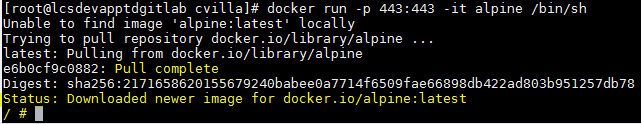

En primer lugar creamos contenedor (como root), con el siguiente comando::

    docker run -p 443:443 -it alpine /bin/sh

* docker run: Comando para crear contenedor basado en la imagen de ISO alpine.

* -p:         Puerto a utilizar el contenedor puerto_maquina:puerto_contenedor.

* -it:        Interactivo (al salir se siga ejecutando el contenedor) y habilitar tty

* alpine:     ISO a descargar de los repositorios oficiales de docker cuando se ejecute el comando docker run. 

* /bin/sh:    Habilitar acceso por ssh.

Al ejecutar el comando realiza un pull complete (descarga imagen particular al repositorio local) e ingresa al contenedor recien creado.

TIPS:

apk add (Instalar paquetes en alpine )

export http_proxy=http://ip_proxy:puerto (exportar proxy)

